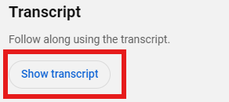
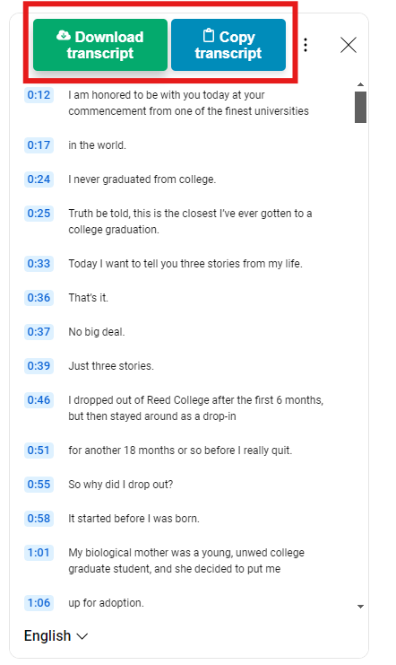

#  TubeWriter

TubeWriter is a simple extension that allows you to download or copy YouTube transcriptions to your clipboard with ease.

## How to use this plugin

- Go to the YouTube video you want transcribed.
- Expand the video description by clicking the description box.
  
- Scroll to the bottom to find the Transcript section.
- Click the "Show transcript" button.
  
- The full transcript will appear next to the video player.
- Click "Download transcript" or "Copy transcript".
  

---

© 2024 Martino Bordin  
[martinobordin.it](https://www.martinobordin.it)  
[info@martinobordin.it](mailto:info@martinobordin.it)
